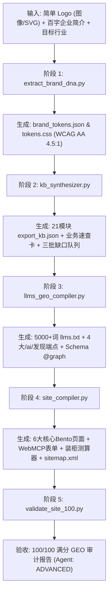

# B2B Global Brand Site Master

> 面向外贸企业品牌出海的全行业专业独立站智能建站总控技能。只需企业 Logo 与百字简介，一键全自动推演全套 VI 规范、21 模块企业事实中台、5,000+ 词 llms.txt、WebMCP 智能体表单协议及 100/100 满分 GEO 独立站。

[](LICENSE)
[](references/03_seo_geo_100_scoring_rubric.md)
[](references/04_webmcp_agent_interaction_spec.md)
[](references/02_export_kb_21_modules_matrix.md)

---

## 🏛️ 项目定位与技术融合

本项目深度融合了三大开源/内部核心技术体系与前沿 B2B 转化架构：

1. **[`cnproduct/brand-visual-system-master`](https://github.com/cnproduct/brand-visual-system-master)**：从极简 Logo 一键解构色彩 DNA、计算 60-30-10 工业配比、通过 WCAG 2.1 AA/AAA 对比度强制矫正，生成 W3C DTCG 兼容的标准 `tokens.css` 与 3D 渲染提示词工程；
2. **[`cnproduct/renwork-export-kb-suite`](https://github.com/cnproduct/renwork-export-kb-suite)**：基于 21 模块外贸出口知识中台（00–20 模块），以“事实先于生成、证据强于承诺”为原则，自动化推演 Good/Better/Best 阶梯报价方案、AQL 0.65 质检节点、公英双制式物性表与 8 大不可逾越红线；
3. **[`cnproduct/renwork-seo-geo-optimizer`](https://github.com/cnproduct/renwork-seo-geo-optimizer)**：2026 年面向 ChatGPT Search、Perplexity、Claude 及 Google AI Overviews 的 100/100 满分 GEO 引擎，部署 5,000+ 词深度 `llms.txt`、4 大 AI 发现端点（`ai.txt`, `summary.json`, `faq.json`, `service.json`）与包含 Organization/Person/Product/TechArticle 的 Schema.org 知识图谱；
4. **WebMCP 2026 智能体原生交互协议**：在表单与测算工具上直接注解 `toolname`、`tooldescription`、`toolparamdescription`，使全站达到 **ADVANCED** 级智能体就绪度，让 AI 代理（OpenAI Operator 等）能够直接代客发起询盘与索样；
5. **高转化工业 Bento Grid 与组件库**：工业级 Bento 栅格、实时装柜容积与到岸成本测算器（Sourcing Estimator）、移动端 3 键拇指船坞（WhatsApp / Sample Kit / Spec PDF）与 clean 无后缀规范路径。

---

## ⚡ 5 阶全自动生成流水线



---

## 🚀 极速上手 (Quick Start)

### 单行命令生成全套独立站
只需在命令行中执行：

```bash
python3 scripts/orchestrator.py \
  --name "Apex Precision Machinery" \
  --intro "We are an ISO 9001 certified manufacturer of 5-axis CNC machining centers and precision automation systems in Ningbo with 50 CNC machines exporting to Germany, North America, and UAE." \
  --industry machinery \
  --domain apexmachinery.com \
  --email sales@apexmachinery.com \
  --logo path/to/logo.png \
  --out ./output_site
```

---

## 🌐 预置 12 大出口支柱产业适配矩阵

系统内置行业参数字典（`templates/industry_profiles.json` 与 `references/06_industry_vertical_adapters.md`）：

| 行业 ID | 行业分类名称 | 核心测试标准与认证 | 关键硬核技术参数与公差 |
|:---|:---|:---|:---|
| `machinery` | 工业机械与数控机床 | ISO 230-2, CE-MD (2006/42/EC), UL 508A | 重复定位精度 $\pm 0.003\text{ mm}$、主轴 $12,000\text{ RPM}$ |
| `stone_cladding` | 建筑石材与新型板材 | CSI MasterFormat, ASTM C170, ASTM C880, CE-CPR | 厚度 $1.5\text{–}2.0\text{ mm} \pm 0.2\text{ mm}$、超轻 $1.5\text{ kg/}\text{m}^2$ |
| `footwear` | 鞋类箱包与服饰纺织 | SATRA TM144, ISO 20345, OEKO-TEX 100, BSCI | 弯折 $\ge 100,000$ 次无裂纹、剥离力 $\ge 4.0\text{ N/mm}$ |
| `hygiene_medical` | 卫品卫生用品与医疗耗材 | FDA 510(k), CE-MDR, ISO 13485, ISO 10993 | 瞬吸 8 秒、吸收量 $\ge 800\text{ ml}$、回渗量 $\le 0.1\text{ g}$ |
| `consumer_electronics` | 消费电子与智能硬件 | FCC Part 15, CE-RED, RoHS 2.0, UN38.3, Qi 2.0 | 氮化镓转换率 $\ge 94\%$、1.2米跌落通过、$-20^\circ\text{C} \sim +60^\circ\text{C}$ |
| `chemicals_pharma` | 精细化工与医药原料 (牛磺酸) | USP / EP / JP 药典, GMP, ISO 22000, HALAL | 纯度 $\ge 99.0\%\sim 101.0\%$、重金属 $\le 10\text{ ppm}$、透光率 $\ge 98\%$ |
| `auto_parts` | 汽配五金与标准件紧固件 | IATF 16949:2016, ISO 898-1, DIN 933, ASTM B117 | 10.9/12.9级合金钢、盐雾测试 $\ge 720\text{h}$ 无红锈、6g/6H 精密公差 |
| `eco_packaging` | 环保包材与降解餐具 | BPI (ASTM D6400), EN 13432, FDA 21 CFR, LFGB | 90–180天 100% 工业堆肥降解、耐温 $-20^\circ\text{C} \sim +120^\circ\text{C}$、无氟 PFAS-Free |
| `solar_energy` | 光伏储能与清洁能源 | IEC 61215, UL 1973, UL 9540A, UN38.3 | N型TOPCon效率 $\ge 22.8\%$、磷酸铁锂循环 $\ge 6,000$ 次、25年功率质保 |
| `home_appliances` | 家用电器与商用厨电 | CB 体系, CE-LVD/EMC, ETL / UL 197, NSF | 食品级 SUS304 不锈钢、PID 控温 $\pm 0.5^\circ\text{C}$、MTBF $\ge 30,000\text{ h}$ |
| `pet_products` | 宠物用品与宠物食品 | AAFCO 营养标准, FDA 注册, USDA 有机, BSCI | 冻干纯肉粗蛋白 $\ge 65\%$、背带耐拉力 $\ge 350\text{ kg}$、3秒瞬时结团 |
| `furniture` | 商用办公家具与空间道具 | BIFMA X5.1 / X5.5, EN 1335, CARB P2, FSC | 底盘静压 $\ge 1,360\text{ kg}$、甲醛 $\le 0.05\text{ ppm}$、静音舱降噪 $\ge 32\text{ dB}$ |

---

## 📊 100/100 满分 GEO 质量审计结果

全案成果通过内置验收工具 `scripts/validate_site_100.py` 验证：

```
============================================================
  RENWORK 100/100 GEO & SEO AUDIT REPORT
  Total Score: 100 / 100
  Agent Readiness: ADVANCED
============================================================
  [✓] link_health         : 15/15 - Zero broken links, zero pseudo-protocols, zero template leakage.
  [✓] keyword_density     : 10/10 - NLP Density safely balanced within golden range (~1.29%).
  [✓] llms_depth          : 18/18 - 5311 words compiled with structured companion references.
  [✓] ai_discovery        : 12/12 - 4 / 4 endpoints verified.
  [✓] schema_eeat         : 16/16 - Full 4-Pillar E-E-A-T Knowledge Graph bound (Org, Person, TechArticle, Product).
  [✓] rag_capsules        : 15/15 - H2 sections structured with Answer-First conclusion preceding technical tables.
  [✓] webmcp_readiness    : 14/14 - ADVANCED level declarative form tools decorated for AI agents.
============================================================
```

---

## 📂 核心文件架构

```
.
├── SKILL.md                                 # Antigravity / Claude 智能体技能标准规范
├── manifest.json                            # 技能元数据清单
├── references/                              # 理论、规范与行业参数库
│   ├── 01_brand_visual_dna_bridge.md        # 标志解构、色相聚类与 WCAG 对比度计算
│   ├── 02_export_kb_21_modules_matrix.md    # 21 模块外贸知识中台映射表与六态置信度
│   ├── 03_seo_geo_100_scoring_rubric.md     # 2026 AI 搜索引文机制与 100 分评分细则
│   ├── 04_webmcp_agent_interaction_spec.md  # WebMCP 2026 智能体表单协议与工具声明
│   ├── 05_b2b_cro_bento_components.md       # 工业 Bento Grid、动态装柜测算器与指轮坞
│   └── 06_industry_vertical_adapters.md     # 12 大主流出口行业硬核参数字典
├── templates/
│   ├── industry_profiles.json               # 12 大行业结构化数据库
│   └── assets/
│       ├── css/b2b-industrial-core.css      # Bento 布局、测算器与移动端指轮坞样式
│       └── js/sourcing_estimator.js         # 实时 CBM 容积与集装箱装载率测算脚本
├── scripts/                                 # 确定性自动化处理脚本
│   ├── orchestrator.py                      # 总控流水线 CLI
│   ├── extract_brand_dna.py                 # Logo 提取与 Design Tokens 编译
│   ├── kb_synthesizer.py                    # 21 模块事实中台合成器
│   ├── llms_geo_compiler.py                 # 5,000+ 词 llms.txt、AI 端点与 Schema 编译器
│   ├── site_compiler.py                     # 出版级响应式独立站多页面编译器
│   └── validate_site_100.py                 # 100/100 满分 GEO 质量审计门禁
└── examples/
    └── case_study_apex/                     # 端到端实测验证完整产物
```

---

## 📄 License
MIT License © 2026 cnproduct
