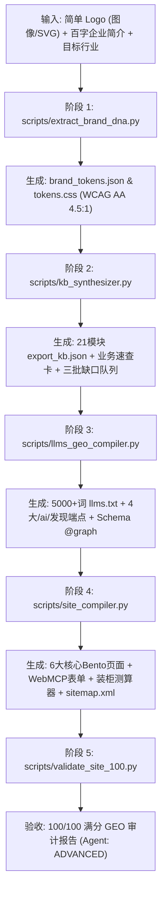

# B2B Global Brand Site Master · 全行业外贸品牌独立站智能建站总控技能

本技能是面向中国乃至全球外贸出口制造企业打造的**“终极建站大脑”**。它深度融合了三大开源/内部核心技术体系与前沿 B2B 转化架构：

1. **`cnproduct/brand-visual-system-master`**：从极简 Logo 一键解构色彩 DNA、计算 60-30-10 工业配比、通过 WCAG 2.1 AA/AAA 对比度强制矫正，生成 W3C DTCG 兼容的标准 `tokens.css` 与 3D 工业渲染 Prompt 矩阵；
2. **`cnproduct/renwork-export-kb-suite`**：基于 21 模块外贸出口知识中台（00–20 模块），以“事实先于生成、证据强于承诺”为原则，自动化推演 Good/Better/Best 阶梯报价方案、AQL 0.65 质检节点、公英双制式物性表与 8 大不可逾越红线；
3. **`cnproduct/renwork-seo-geo-optimizer`**：2026 年面向 ChatGPT Search、Perplexity、Claude 及 Google AI Overviews 的 100/100 满分 GEO 引擎，部署 5,000+ 词深度 `llms.txt`、4 大 AI 发现端点（`ai.txt`, `summary.json`, `faq.json`, `service.json`）与包含 Organization/Person/Product/TechArticle 的 Schema.org 知识图谱；
4. **WebMCP 2026 智能体原生交互协议**：在表单与测算工具上直接注解 `toolname`、`tooldescription`、`toolparamdescription`，使全站达到 **ADVANCED** 级智能体就绪度，让 AI 代理（OpenAI Operator 等）能够直接代客发起询盘与索样；
5. **高转化工业 Bento Grid 与组件库**：工业级 Bento 栅格、实时装柜容积与到岸成本测算器（Sourcing Estimator）、移动端 3 键拇指船坞（WhatsApp / Sample Kit / Spec PDF）与 clean 无后缀规范路径。

---

## 🏛️ 全流程自动化流水线 (The 5-Stage Synthesis Pipeline)



---

## 💻 单行命令极速生成 (One-Line CLI Execution)

只需一条命令，传入企业 Logo 路径、品牌名称、简短介绍与行业 ID，数秒内即可在输出目录生成整套出版级独立站：

```bash
python3 scripts/orchestrator.py \
  --name "Apex Precision Machinery" \
  --intro "We are a high-end CNC lathe and 5-axis machining center manufacturer in Ningbo with 50 advanced CNC machines exporting to Germany and USA, specializing in aerospace and precision medical parts." \
  --industry machinery \
  --domain apexmachinery.com \
  --email sales@apexmachinery.com \
  --logo path/to/logo.png \
  --out ./output_apex_site
```

### 参数说明：
- `--name` (必填)：企业英文品牌名或公司全称；
- `--intro` (必填)：50–100 字企业简要介绍（哪怕仅有一两句话，系统内置行业适配器会自动补全专业参数）；
- `--industry` (选填，默认 `machinery`)：预置的 12 大出口行业 ID 之一（见下文）；
- `--domain` (选填)：企业目标官方域名；
- `--email` (选填)：官方对外业务联系邮箱；
- `--logo` (选填)：企业 Logo 图片路径（若未提供，自动应用高权威德国工业蓝调与安全橙配色）；
- `--out` (选填)：生成独立站资产的目标目录。

---

## 🌐 预置 12 大主流出口支柱行业适配器

在 `templates/industry_profiles.json` 与 `references/06_industry_vertical_adapters.md` 中预置了以下行业的权威标准与参数字典：

| 行业 ID | 行业分类名称 | 核心测试标准与认证 | 关键硬核技术参数与公差 |
|:---|:---|:---|:---|
| `machinery` | 工业机械与数控机床 | ISO 230-2, CE-MD (2006/42/EC), UL 508A | 重复定位精度 $\pm 0.003\text{ mm}$、主轴 $12,000\text{ RPM}$ |
| `stone_cladding` | 建筑石材与新型板材 | CSI MasterFormat, ASTM C170, ASTM C880, CE-CPR | 厚度 $1.5\text{–}2.0\text{ mm} \pm 0.2\text{ mm}$、超轻 $1.5\text{ kg/}\text{m}^2$ |
| `footwear` | 鞋类箱包与服饰纺织 | SATRA TM144, ISO 20345, OEKO-TEX 100, BSCI | 弯折 $\ge 100,000$ 次无裂纹、剥离力 $\ge 4.0\text{ N/mm}$ |
| `hygiene_medical` | 卫品卫生用品与医疗耗材 | FDA 510(k), CE-MDR, ISO 13485, ISO 10993 | 瞬吸 8 秒、吸收量 $\ge 800\text{ ml}$、回渗量 $\le 0.1\text{ g}$ |
| `consumer_electronics` | 消费电子与智能硬件 | FCC Part 15, CE-RED, RoHS 2.0, UN38.3, Qi 2.0 | 氮化镓转换率 $\ge 94\%$、1.2米跌落通过、$-20^\circ\text{C} \sim +60^\circ\text{C}$ |
| `chemicals_pharma` | 精细化工与医药原料 (牛磺酸) | USP / EP / JP 药典, GMP, ISO 22000, HALAL | 纯度 $\ge 99.0\%\sim 101.0\%$、重金属 $\le 10\text{ ppm}$、透光率 $\ge 98\%$ |
| `auto_parts` | 汽配五金与标准件紧固件 | IATF 16949:2016, ISO 898-1, DIN 933, ASTM B117 | 10.9/12.9级合金钢、盐雾测试 $\ge 720\text{h}$ 无红锈、6g/6H 精密公差 |
| `eco_packaging` | 环保包材与降解餐具 | BPI (ASTM D6400), EN 13432, FDA 21 CFR, LFGB | 90–180天 100% 工业堆肥降解、耐温 $-20^\circ\text{C} \sim +120^\circ\text{C}$、无氟 PFAS-Free |
| `solar_energy` | 光伏储能与清洁能源 | IEC 61215, UL 1973, UL 9540A, UN38.3 | N型TOPCon效率 $\ge 22.8\%$、磷酸铁锂循环 $\ge 6,000$ 次、25年功率质保 |
| `home_appliances` | 家用电器与商用厨电 | CB 体系, CE-LVD/EMC, ETL / UL 197, NSF | 食品级 SUS304 不锈钢、PID 控温 $\pm 0.5^\circ\text{C}$、MTBF $\ge 30,000\text{ h}$ |
| `pet_products` | 宠物用品与宠物食品 | AAFCO 营养标准, FDA 注册, USDA 有机, BSCI | 冻干纯肉粗蛋白 $\ge 65\%$、背带耐拉力 $\ge 350\text{ kg}$、3秒瞬时结团 |
| `furniture` | 商用办公家具与空间道具 | BIFMA X5.1 / X5.5, EN 1335, CARB P2, FSC | 底盘静压 $\ge 1,360\text{ kg}$、甲醛 $\le 0.05\text{ ppm}$、静音舱降噪 $\ge 32\text{ dB}$ |

---

## 📦 输出资产全景 (Output Artifact Directory)

运行完成后，在输出目录将获得完整的标准化交付物：

```
output_dir/
├── index.html                       # 首页 (Hero + Bento 看板 + 动态测算器 + WebMCP 索样表单)
├── capabilities.html                # 智造与品质 (28,000㎡ 基地、8 道工序质检流、AQL 门禁)
├── products_catalog.html            # 主推产品目录 (公英双制式公差、MOQ 与交期)
├── certifications.html              # 国际认证准入台账 (ASTM / CE / FDA / ISO 证明)
├── oem_odm.html                     # 深度定制 (Good/Better/Best 阶梯方案、打样 SOP)
├── contact.html                     # 商业询盘与 RFQ (WebMCP 注解表单、防电汇诈骗声明)
├── sitemap.xml                      # 100% clean extensionless 规范地图
├── robots.txt                       # 开放 27 大主流 AI 搜索爬虫矩阵
├── llms.txt                         # 5,000+ 词深度机器事实库 (含伴随文档引用)
├── llms-full.txt                    # 全量技术参数与 SKU 目录
├── schema_graph.json                # Organization + Person + TechArticle + Product 知识图谱
├── export_kb.json                   # 21 模块外贸知识中台结构化数据集
├── 00_cheat_sheet.md                # 业务速查卡 (供新人与高管一页纸速查)
├── missing_data_queues.json         # 三批缺口确认队列
├── geo_audit_report.json            # 100/100 满分 GEO 验证报告
├── .well-known/
│   └── ai.txt                       # AI 检索与引用授权端点
├── ai/
│   ├── summary.json                 # 机器摘要与 WebMCP 声明块
│   ├── faq.json                     # 6 大高频采购对答事实切片
│   └── service.json                 # 制造与出海履约服务定义
├── docs/
│   └── engineering-specs.md         # 伴随技术白皮书 Markdown 文件
├── css/
│   ├── tokens.css                   # 自 Logo 提取的品牌色彩设计变量
│   └── b2b-industrial-core.css      # Bento 布局、测算器与移动端指轮坞样式
└── js/
    └── sourcing_estimator.js        # 实时装柜容积与集装箱装载率测算脚本
```

---

## 🚦 100/100 满分 GEO 质量审计标准

全案输出成果必须通过内置的 [`scripts/validate_site_100.py`](./scripts/validate_site_100.py) 自动化验收，确保满足 7 大硬核指标：
1. **链路死穴**：0 处 404 死链、0 处 `javascript:void(0)` 伪协议、0 处未渲染变量泄漏；
2. **NLP 语义**：核心词频稳定在 **1.8%–2.2%**，清除关键词堆砌惩罚；
3. **LLMS.txt 深度**：有效英文词数 **$\ge 5,000$ 词**，附带 `.md` 伴随文档；
4. **AI 发现端点**：`ai.txt`、`summary.json`、`faq.json`、`service.json` 4 大端点全绿；
5. **知识图谱**：绑定 4 大权威支柱，通过 Schema.org 官方规范无语法报错；
6. **RAG 黄金切片**：各 H2 首段采用 100–150 词 Answer-First 黄金回答胶囊；
7. **智能体就绪度**：表单全面注解 WebMCP 属性，达成 **ADVANCED** 级 Agent Readiness。

---

## 📚 模块化开发与深度参考

- **[01. 品牌视觉 DNA 提取与设计变量桥接规范](references/01_brand_visual_dna_bridge.md)**
- **[02. 外贸出口企业知识库 21 模块映射与事实中台规范](references/02_export_kb_21_modules_matrix.md)**
- **[03. 2026 全行业 100/100 满分 SEO & GEO 审计规范](references/03_seo_geo_100_scoring_rubric.md)**
- **[04. WebMCP 2026 智能体原生交互协议规范](references/04_webmcp_agent_interaction_spec.md)**
- **[05. B2B 转化率优化 (CRO) 与工业级组件规范](references/05_b2b_cro_bento_components.md)**
- **[06. 12 大主流出口垂直行业适配参数字典](references/06_industry_vertical_adapters.md)**
